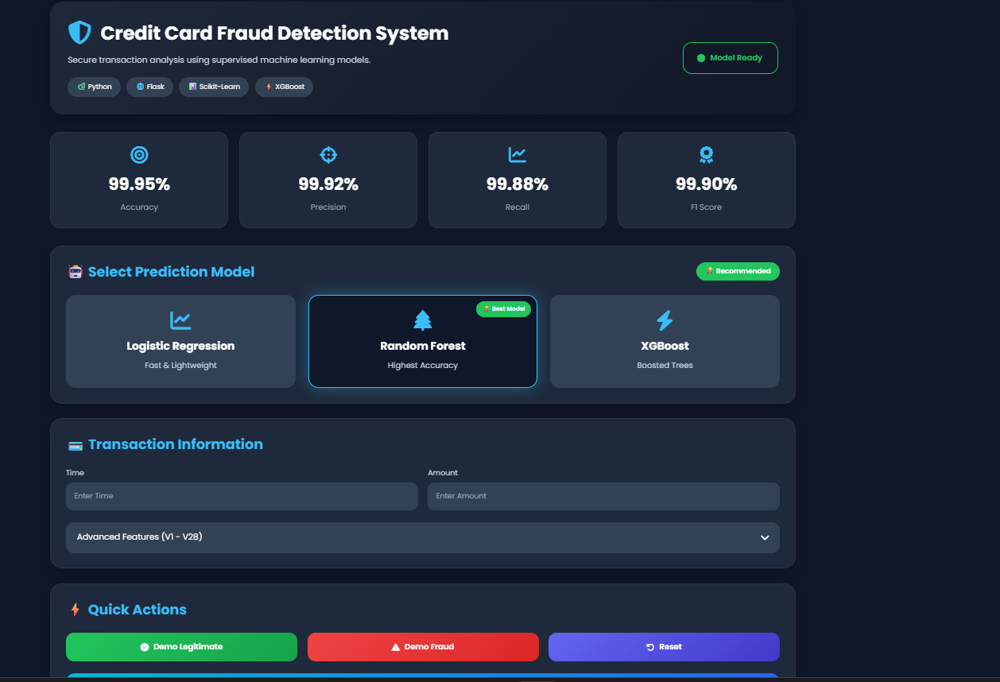
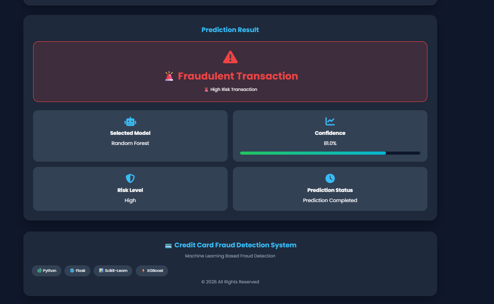

# 💳 Credit Card Fraud Detection System

> **Machine Learning Based Web Application for Detecting Fraudulent
> Credit Card Transactions**

------------------------------------------------------------------------

## 📖 Overview

This project is a complete end-to-end Machine Learning application that
detects fraudulent credit card transactions using supervised learning
algorithms. It provides a modern Flask-based web interface where users
can enter transaction details, choose a trained model, and receive a
prediction with confidence.

### Objectives

-   Detect fraudulent transactions accurately.
-   Compare multiple ML algorithms.
-   Build a production-style Flask web application.
-   Demonstrate an end-to-end ML workflow.

------------------------------------------------------------------------

## ✨ Features

-   Modern responsive dashboard
-   Logistic Regression, Random Forest, XGBoost
-   Demo Legitimate and Demo Fraud buttons
-   Model selection
-   Confidence score
-   Risk level
-   Model performance comparison
-   Responsive HTML/CSS/JavaScript frontend
-   Flask backend

------------------------------------------------------------------------

## 🧠 Machine Learning Workflow

1.  Data Collection
2.  Data Cleaning
3.  Exploratory Data Analysis
4.  Feature Scaling
5.  Train/Test Split
6.  SMOTE Oversampling
7.  Model Training
8.  Model Evaluation
9.  Model Saving
10. Flask Deployment

------------------------------------------------------------------------

## 📊 Dataset

**Dataset:** Credit Card Fraud Detection Dataset (Kaggle)

  Item               Value
  -------------- ---------
  Transactions     284,807
  Legitimate       284,315
  Fraudulent           492
  Features              30

Target: - 0 = Legitimate - 1 = Fraudulent

------------------------------------------------------------------------

## ⚙️ Data Preprocessing

-   Missing value check
-   Duplicate check
-   StandardScaler
-   Train/Test Split
-   SMOTE
-   Feature engineering

------------------------------------------------------------------------

## 🤖 Models

Three supervised machine learning models were trained and evaluated for credit card fraud detection.

| Model | Description | Accuracy |
|---|---|---:|
| Random Forest | Ensemble learning model using multiple decision trees | **99.95%** |
| XGBoost | Gradient boosting classification model | **99.92%** |
| Logistic Regression | Linear classification model used as a baseline | **97.48%** |

### 📊 Model Performance

- 🌲 **Random Forest:** 99.95%
- ⚡ **XGBoost:** 99.92%
- 📈 **Logistic Regression:** 97.48%

### 🏆 Best Performing Model

**Random Forest achieved the highest accuracy of 99.95%.**

> Accuracy alone should not be considered sufficient for fraud detection because fraudulent transactions are highly imbalanced with legitimate transactions. Precision, Recall, and F1-Score are also important evaluation metrics.

------------------------------------------------------------------------

## 🖥️ Project Structure

``` text
Credit Card Fraud Detection System/
│
├── dataset/
│   └── creditcard.csv
├── models/
│   ├── logistic_regression.pkl
│   ├── random_forest.pkl
│   ├── xgboost.pkl
│   └── scaler.pkl
├── static/
│   ├── style.css
│   └── script.js
├── templates/
│   └── index.html
├── app.py
├── requirements.txt
├── README.md
└── LICENSE
```

------------------------------------------------------------------------

## 🛠️ Technologies

-   Python
-   Flask
-   Scikit-learn
-   XGBoost
-   Pandas
-   NumPy
-   Matplotlib
-   Seaborn
-   HTML5
-   CSS3
-   JavaScript

------------------------------------------------------------------------

## 🚀 Installation

``` bash
git clone https://github.com/krishnaavidhate/Credit-Card-Fraud-Detection-System.git

cd Credit-Card-Fraud-Detection-System

pip install -r requirements.txt

python app.py
```

Open:

``` text
http://127.0.0.1:5000
```

------------------------------------------------------------------------

## 💡 Usage

1.  Start the Flask application.
2.  Choose a machine learning model.
3.  Enter transaction values or use Demo buttons.
4.  Click **Predict Transaction**.
5.  Review the prediction, confidence score, and risk level.

------------------------------------------------------------------------

## 📸 Project Screenshots

### Dashboard



### Transaction Prediction



### Fraud Detection Result


------------------------------------------------------------------------

## 🌍 Future Improvements

-   REST API
-   Docker
-   Cloud Deployment
-   Explainable AI (SHAP/LIME)
-   Prediction History
-   User Authentication
-   Model Retraining Pipeline

------------------------------------------------------------------------

## 👨‍💻 Developer

**Krishna Vidhate**

Machine Learning \| Python \| Data Science

GitHub: https://github.com/krishnaavidhate

LinkedIn: www.linkedin.com/in/krishna-vidhate-320a43325

Email: YOUR_EMAIL

------------------------------------------------------------------------

## 📄 License

This project is licensed under the MIT License.

------------------------------------------------------------------------

⭐ If you found this project useful, please consider starring the
repository.
